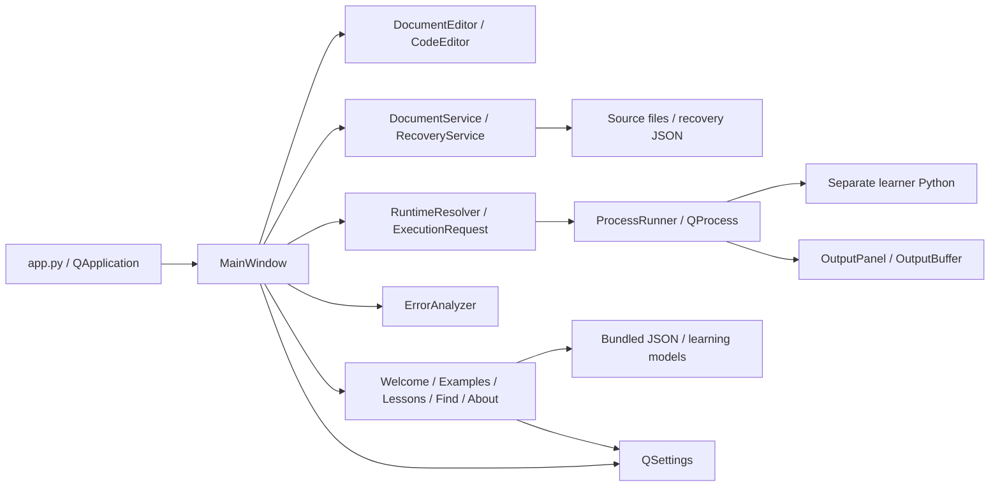

# Architecture

Assessment: 2026-10-01; version 0.1.0, baseline `8f5a3a4`.

## System overview

PyNivo is a local Qt desktop IDE with a `src` package layout. There is no web
frontend/backend, HTTP API, authentication, database server, or cloud service.
Widgets, models, and Qt signals/slots provide local interaction and state.
Core modules do not import Qt; the process adapter deliberately does.

## Startup and UI architecture

`__main__.py` and the installed `pynivo` GUI entry point call `app.main`.
Startup sets Qt identity/icon, configures logging, constructs MainWindow, and
enters the event loop. `--welcome` forces onboarding. `--smoke-test` skips normal
file logging, onboarding, and recovery restoration, scheduling exit after 750 ms;
MainWindow still initializes settings and a recovery timer.

MainWindow owns document tabs, menus, toolbar, rail, editor/output splitter,
file/runtime/error services, process adapter, QSettings, and recovery timer.
There is no web router or external state store.

- `DocumentEditor` extends `CodeEditor` with file identity and dirty titles.
- `CodeEditor` uses QPlainTextEdit, a gutter, QSyntaxHighlighter, four-space
  indentation, and pure matching/indentation helpers in `text_tools.py`.
- `FindReplaceDialog` follows the active tab; literal search supports wrapping,
  optional case sensitivity, replacing a selection, and replace-all.
- `OutputPanel` renders semantic stdout/error chunks and forwards line input.
  OutputBuffer retains the latest 250,000 characters and reports truncation.
- Welcome/examples/lessons dialogs emit actions or models; starter code becomes
  an editable untitled tab and must be saved before execution.
- `themes.py` owns shared palettes/QSS. New screens must use shared widgets and
  palette roles. Theme changes refresh syntax, console, and application styles;
  existing hardcoded bracket colors are technical debt, not a pattern to copy.

## Data layer

| Data | Storage |
| --- | --- |
| Learner programs | User-selected `.py` files via DocumentService |
| Examples/lessons | `learning/data/*.json`, loaded with importlib.resources |
| Course completion | QSettings `learning/completed`, stable lesson IDs |
| Preferences | QSettings `appearance/theme`, `editor/font_size`, `window/geometry` |
| Recent files/onboarding | QSettings `files/recent`, `welcome/seen_version` |
| Recovery | Qt AppLocalDataLocation `recovery/session.json` |
| Logs | Qt AppLocalDataLocation `logs/pynivo.log`, 1 MB plus three backups |

QSettings uses native platform storage (normally Windows registry). There are no
SQL schemas, migrations, or synchronization. CourseProgress is immutable; stored
completion IDs are filtered against bundled lessons. LessonLibrary checks unique
IDs and sorted order. The 18 lessons are manually marked complete, not graded.

DocumentService reads UTF-8 with optional BOM and requires `.py` for opening.
Saving adds `.py` if necessary, writes a temporary sibling, flushes/fsyncs, then
atomically replaces the target. I/O/encoding errors become DocumentError.

RecoveryService stores version-1 JSON with `documents` containing `path` (or null)
and `text`. MainWindow snapshots modified buffers every 15 seconds, prompts on
startup, restores dirty state, and clears snapshots after a clean close. This is
periodic crash recovery, not full saved-tab persistence. Snapshots contain
plaintext learner source. Invalid JSON is ignored, but valid unexpected root
shapes can raise AttributeError because the parsed value is assumed to be a dict.

## Runtime and process architecture

`paths.application_root()` is the checkout root in source runs and the executable
folder when frozen. `resource_path()` uses PyInstaller `_MEIPASS` when available.
RuntimeResolver prefers `runtime/python.exe`, otherwise `sys.executable`.
Bundled validation requires the private location, standard-library ZIP, DLL, and
`._pth` file, then invokes `--version` with a five-second timeout. An invalid
present bundle fails rather than silently falling back. Frozen GUI executables
are not usable development interpreters; distributable builds need the bundle.

ExecutionRequest validates resolved executable/script paths, requires `.py`,
and supplies an argument tuple with the script-parent working directory.
ProcessRunner owns one QProcess, inherits system environment, sets
`PYTHONIOENCODING`/`PYTHONUTF8`, decodes separate channels as UTF-8, and writes
newline-terminated input. Launches never use a shell. Stop terminates the direct
child and schedules kill after two seconds if still running; descendants are
not managed and the callback is not tied to a unique execution generation.

## Data flows

### File editing

Opening reuses a tab for the same resolved path. Qt modified state drives dirty
labels and save/discard/cancel prompts. Atomic save updates the tab identity only
on success. Up to ten recent existing files are retained through QSettings.

### Running a script

Run first saves an untitled/modified tab; cancel aborts. It validates Python,
builds a request, clears old output/stderr, and snapshots the running path/source.
QProcess signals update controls, input, output, and status. Switching tabs does
not change captured run identity. On nonzero exit, ErrorAnalyzer parses stderr
and adds local beginner guidance. The original script tab is selected for a
reported line if still open. The final traceback filename is not checked against
that script; imported-file failures can navigate to an unrelated line.

### Learning and recovery

Welcome normally appears once per app version; menu reopening and `--welcome`
are available. Lessons provide navigation, hints, editable code, reset, and
manual completion persisted by stable ID. Lesson-dialog edits are not persisted
drafts. Copying starter code to an editor starts unmodified; untouched starter
tabs are therefore excluded from periodic modified-buffer snapshots. Recovery
prompts before rebuilding tabs and marks restored buffers modified.

## Error handling

File failures become UI critical dialogs and warning logs. Runtime/request errors
are caught before launch; QProcess startup failures emit `launch_failed` and
restore controls. Recovery snapshot I/O failures are logged. ErrorAnalyzer uses
regular expressions for the last matching exception/location, fixed explanations,
and difflib NameError suggestions. Unknown matching exceptions get a generic
explanation; unrecognized text yields None. Visible output truncation can discard
traceback text even though diagnostic stderr remains unbounded.

## External integrations and security

Normal use has no account, API credentials, telemetry, or remote integration.
Build tooling downloads pinned CPython from python.org; CI fetches dependencies,
uses Chocolatey for Inno Setup, GitHub CLI for draft releases, and SignTool with
a timestamp service for signatures. Compliance docs reference Qt upstream source.

Opening a file never executes it. Explicit learner execution has ordinary user
permissions and inherited environment access: process separation is not a
sandbox. Logs avoid learner source; plaintext recovery and echoed console input
may contain private information. Never commit or upload them as routine diagnostics.

The build checks a hardcoded SHA-256 and rejects ZIP destination traversal before
extraction. No runtime binaries are tracked or downloaded on startup. Signing
secrets become a temporary runner PFX with always-run cleanup. Dispatch inputs
are currently interpolated into PowerShell source; recommended hardening is to
pass them via environment variables. No credential isolation is claimed.

## Testing architecture

42 pytest tests cover files/recovery, runtime/request validation, output limits,
content/progress, errors, editor helpers, themes, onboarding, notices, and static
installer contracts. Content tests compile snippets, not execute all lessons.
Integration tests use a Qt core event loop and real Python children for Unicode
channels, stdin, stopping, duplicates, and launch failures. There is no automated
MainWindow/dialog end-to-end or clean-machine installer suite. CI defines Windows
Python 3.11/3.13 lint, format, and pytest checks.

## Distribution architecture

`packaging/windows/build.py` runs PyInstaller using `pynivo.spec`: onedir windowed
GUI, branding/JSON resources, no UPX, QtWebEngine excluded. It pins CPython 3.13.15
amd64, caches the ZIP in ignored `build/downloads`, verifies SHA-256, extracts to
`dist/PyNivo/runtime`, copies notices/licenses, checks required files, smoke-tests
the isolated learner runtime, and launches `PyNivo.exe --smoke-test` with redirected
`LOCALAPPDATA`. Use Python 3.13 to match release CI and documented Qt replacement ABI.

`build_installer.py` normally builds portable first, discovers ISCC from PATH or
known Inno 7/6 locations, and compiles `pynivo.iss`. `--skip-portable` reuses an
already verified directory without revalidation. `build.py --skip-runtime` is
diagnostics-only. Inno Setup 7 is recommended.

The per-user installer requires Windows >=10, x64-compatible systems, no admin
rights, and defaults to LocalAppData Programs. It includes optional desktop
shortcut creation and interactive `--welcome` launch (skipped when silent).
Output: `dist/installer/PyNivo-0.1.0-Preview-Setup-x64.exe`.

| Workflow | Trigger/result |
| --- | --- |
| `ci.yml` | main push / PR; Ruff and pytest on Python 3.11/3.13 |
| `windows-preview.yml` | Manual build/checksum; installer artifact retained 14 days |
| `unsigned-preview-release.yml` | Manual validated preview tag; quality checks, require NotSigned, checksum, draft prerelease at checkout SHA |
| `release.yml` | Manual tag; require signing secrets, checks, sign/verify, checksum, draft prerelease |

Both release workflows create drafts; source does not prove publication. Signed
release does not explicitly pass checkout SHA to `gh release create`, unlike the
unsigned workflow: verify tag targeting before release. No hosting or automatic
update mechanism exists. Preserve project/dependency notices and LGPL replacement
instructions in every distribution.

Version locations: `pyproject.toml`, `src/pynivo/__init__.py`, Windows
`version_info.txt`, `pynivo.iss`, preview/compliance docs. Runtime pin is separate
in `build.py`. See README for commands and [roadmap](roadmap.md) for limitations
and recommended work.
